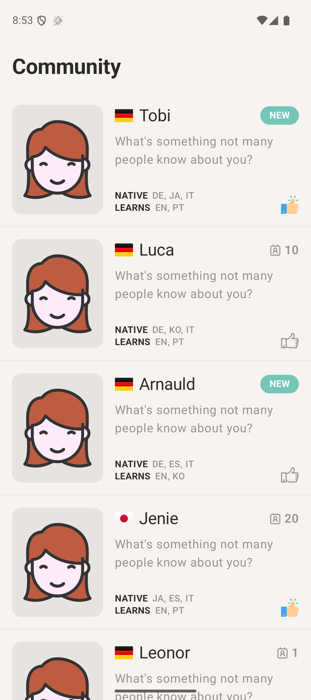
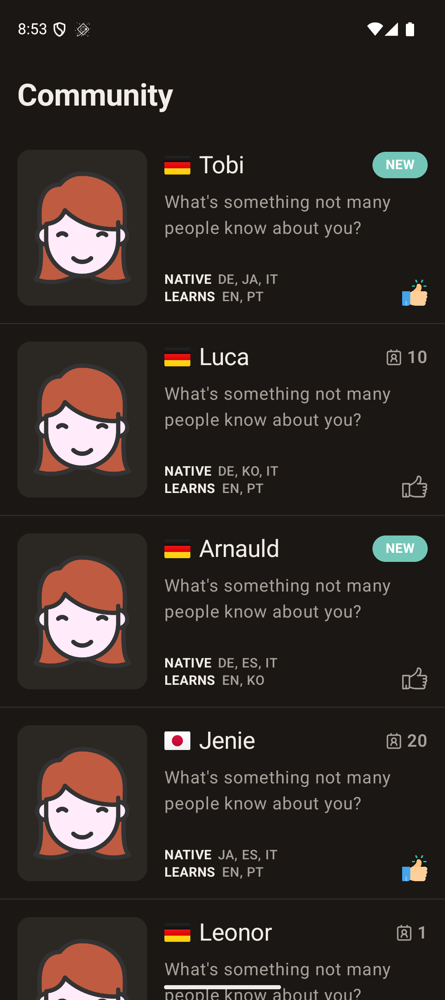

# Community App

[](https://github.com/lucas-cordeiro/community-app/actions/workflows/ci.yml) [](https://codecov.io/gh/lucas-cordeiro/community-app)    [](LICENSE)

A small Android app that lists a language‑learning community (paginated) and lets you like members, with the like state persisted locally. It's a showcase of modular Clean Architecture with Jetpack Compose, a reactive MVVM layer, and solid test coverage.

|                                    Light                                    |                                   Dark                                    |
|:---------------------------------------------------------------------------:|:-------------------------------------------------------------------------:|
|  |  |

## Features

- Paginated community feed (20 per page) with **infinite scroll**; stops when a page returns fewer than 20 items.
- `referenceCnt == 0` shows a **NEW** badge; otherwise the count is shown next to a contact icon.
- Tap a card to **like** it — persisted with DataStore and restored after relaunch (with a pop/crossfade animation).
- A **nationality flag** derived from the member's first native language, shown next to the name.
- Light and dark themes.

## Tech stack

| Concern        | Choice                                                                  |
|----------------|-------------------------------------------------------------------------|
| Language / JVM | Kotlin 2.2 / JVM 21                                                     |
| UI             | Jetpack Compose (Material 3)                                            |
| Navigation     | Navigation Compose (type‑safe routes)                                   |
| MVVM           | [Ymir](https://github.com/lucas-cordeiro/Ymir) (`UiState` / `UiAction`) |
| DI             | Koin 4                                                                  |
| Networking     | Ktor 3 (OkHttp) + kotlinx.serialization                                 |
| Persistence    | DataStore Preferences                                                   |
| Images         | Coil 3                                                                  |
| Flags          | flagkit‑compose                                                         |
| Coverage       | Kover                                                                   |
| Tests          | JUnit, MockK, Coroutines Test, Compose UI Test, Ktor MockEngine         |

Min SDK 24 · Compile/Target SDK 36 · AGP 8.13.

## Architecture

Modular Clean Architecture following [*The Real Clean Architecture in Android — Modularization*](https://medium.com/clean-android-dev/the-real-clean-architecture-in-android-modularization-e26940fd0a23). Dependency direction is `feature → component → shared`; the UI never touches data sources directly.

```
app
├── shared
│   ├── core            errors, logger
│   ├── network         Ktor HttpClient + base URL
│   ├── storage         DataStore PreferenceManager
│   ├── ui              theme, ThemePreviews, PreviewContainer
│   ├── ui:test         MainDispatcherRule, ScreenRobot
│   └── network:test    HttpClientMock (Ktor MockEngine)
├── component
│   └── community       domain (model / repository / use cases) + data (data sources / mapper / repository impl)
└── feature
    └── community        CommunityScreen + composables + CommunityViewModel
```

- **`shared/*`** — infrastructure reused everywhere, plus test‑support split per layer.
- **`component/*`** — domain + data, reusable across features.
- **`feature/*`** — UI + navigation only; business logic lives in components.

**Why modular:** clear separation of concerns and dependency direction, isolated/faster builds and tests per module, and test‑support tailored per layer (`network:test` for data, `ui:test` for UI) so each layer pulls only what it needs.

**Reactive likes:** the repository merges the fetched page with a `Flow<Set<Int>>` of liked ids (DataStore). Toggling writes to DataStore → the flow re‑emits → `CommunityViewModel` recomputes the list `isLiked`. The like reflects immediately and survives relaunch.

## Build & run

Requires JDK 21 and the Android SDK (set `sdk.dir` in `local.properties`).

```bash
# install & run debug
./gradlew :app:installDebug

# minified, signed release APK
./gradlew :app:assembleRelease
# → app/build/outputs/apk/release/app-release.apk
```

The release runs R8 (`minifyEnabled true` + resource shrinking) and is signed with the debug key.

## Tests

```bash
./gradlew test                       # unit tests (JVM)
./gradlew connectedDebugAndroidTest  # instrumented tests (device/emulator)
./gradlew :app:koverHtmlReport       # coverage → app/build/reports/kover/html
./gradlew :app:koverVerify           # fails if line coverage < 80%
```

- **Unit:** `CommunityViewModel` (pagination, reactive like, error/retry), repository (isLiked merge, nationality mapping, end‑of‑pages), local data source (toggle/observe), network data source (URL + parsing + error via Ktor `MockEngine`), model & domain.
- **Instrumented:** `CommunityScreen` Compose UI (render, NEW vs count, click) with a **Robot pattern**; DataStore persistence round‑trip.
- Reusable test‑support: `HttpClientMock` (a per‑test configurable request handler) and `ScreenRobot`.

### Coverage

Kover reports **100% line coverage** on the unit‑tested logic (domain / data / presentation). Excluded from the metric (intentional): generated code, DI wiring, `Application`/`MainActivity`, navigation routes, theme, Compose UI composables (covered by instrumented tests), the HTTP client config, and `PreferenceManagerImpl` (covered by an instrumented test). A `koverVerify` gate enforces ≥ 80%.

## License

MIT — see [LICENSE](LICENSE).
